# WatsonML-CNN4HandwrittenNum

## Handwritten digit recognition with MNIST on iOS build using IBM Watson Studio & Watson Machine Learning capabilities - Part 1 : for dummies.

This tutorial shows IBM Watson Studio framework capabilities to load training data to the IBM Cloud Object Storage (COS) area, create a convolutional neural network (CNN) model that is build and trained with IBM Watson Machine Learning kernel. I´ll show how the model can be exported & integrated in iOS and can be accessed in code (Objective-C in this Tutorial) via the new CoreML and Vision Api introduced by apple for iOS11. 
I trained the model on the MNIST dataset in order to create an app that can recognize handwritten digits.
The iphone application used in this tutorial is from [Eridy Lukau](https://github.com/boaerosuke) accessible at this [URL](https://github.com/boaerosuke/digitrecognition_ios) 

##Introduction
Watson Studio provides you with the environment and tools to solve your business problems by collaboratively working with data. You can choose the tools you need to analyze and visualize data, to cleanse and shape data, to ingest streaming data, or to create, train, and deploy machine learning models.

This illustration shows how the architecture of Watson Studio is centered around the project. A project is where you organize your resources and work with data.

IBM Watson Studio is a collaborative environment with end to end AI tools that you and your team can use to collect and prepare training data, and to design, train, and deploy machine learning models.

Ranging from graphical tools you can use to build a model in minutes, to tools that automate running thousands of experiment training runs and hyperparameter optimization, Watson Studio AI tools support popular frameworks, including: TensorFlow, Caffe, PyTorch, and Keras.
In this first part dedicated to dummies data scientist, we will use Watson Studio graphical tools to :

1. Load & store the training data
0. Model the Artificial Neural Network
0. Run it against the trainign data
0. Score the created model using test/validation data
0. Deploy the model
0. Export it as a CoreML Apple iOS model
0. Embed it into an iphone application

Finally use the application to test your own "finger written" numbers ! 

##1-Load, Store, Organize your data
First, to access Watson Studio environment, you need your IBM ID. 
Visit [IBM Dataplatform](http://dataplatform.ibm.com) and create your free account. Most of the cloud and cognitive services are for free, so you can learn, develop your models and deploy them for productive use.

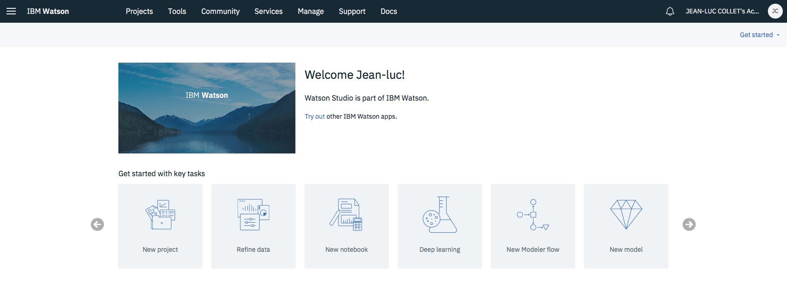

For this tutirial I used the [MNIST](https://en.wikipedia.org/wiki/MNIST_database) computer vision data set to train our deep learning model to recognize handwritten digits.
The Data set from MNIST can be found [here] (https://github.com/LZRVC/mnist-with-keras-and-watson-studio)
Select the file called mnist-tf-dataset.zip, download it. (see below the content of that file)

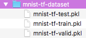

In order to load your training data you must create a Cloud Object Storage instance, to do so process as follow :

Click on the Services item and choose Data services

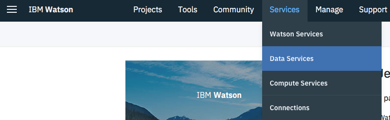

From there add/create a new Cloud Object Storage instance

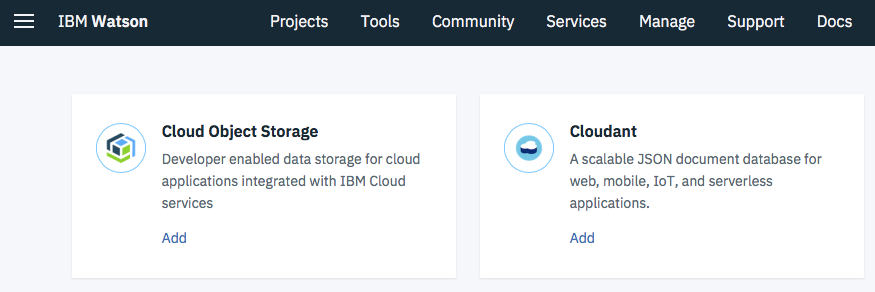

Add 3 Buckets to host your traing, test and validation data

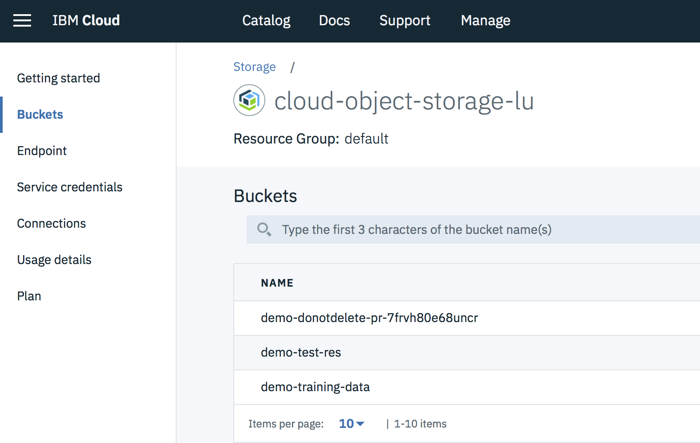

##2-Model the Artificial Neural Network

Using the graphical flow editor in Watson Studio (see below) you can create a new model 

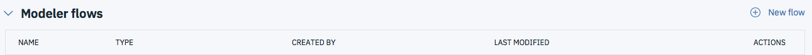

Create one with the appropriate options as shown hereafter :

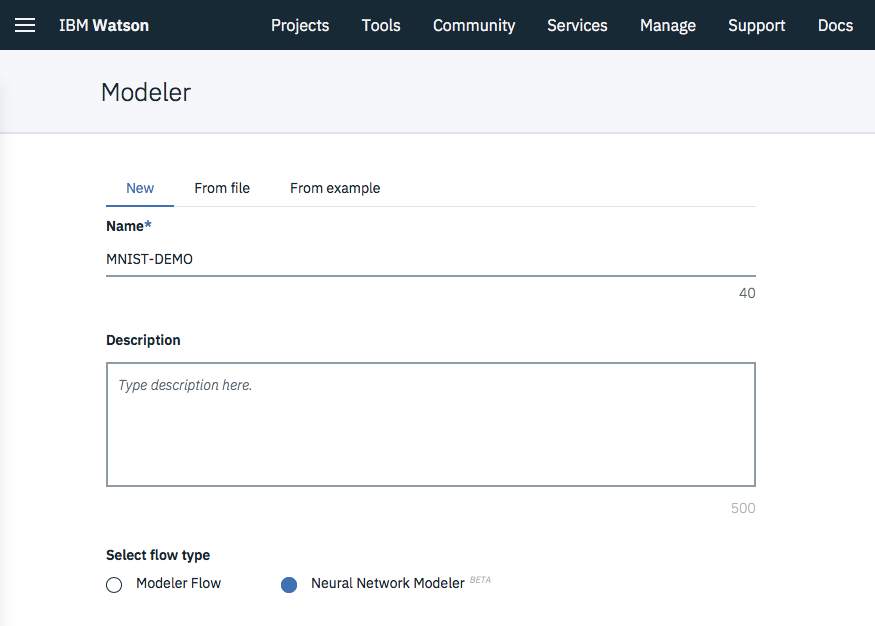

you can assemble your machine learning model or neural network design by dragging and dropping nodes from a palette. In this tutorial, you don't have to design your neural network from scratch. Instead, this tutorial demonstrates how you can import a neural network flow from a predefined flow.

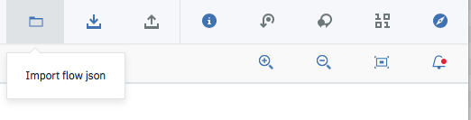

From the toolbar select the import icon and select the file called ModelMNIST.nnd

As a result you should see the following flow in the graphical editor

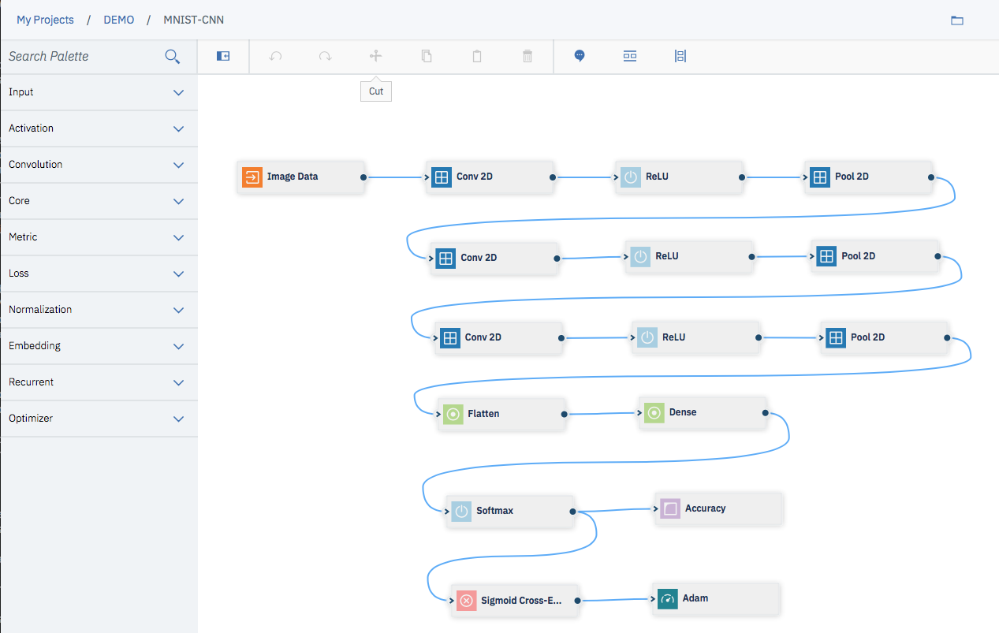

Double-click the first node, labeled Image Data (this opens the node details side panel.)
In the details side panel, in the DATA section, create a connection to the Cloud Object Storage instance you associated with this project:

1. click Create a new connection.
0. Specify a name for the connection.
0. Click the Create a connection button.
0. Click Back.
0. In the Data Connections drop-down menu, select the Cloud Object Storage connection that you just created.
0. In the Buckets drop-down menu, select the training, test an validata data bucket you created before at step 1.

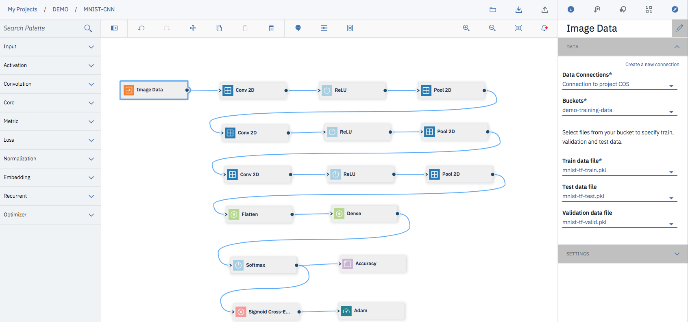

##3-Run it against the trainign data

Now we need to publish our newly created model for training

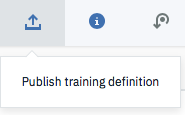

This creates a New Experiment in your Watson Project

##4-Score the created model using test/validation data

Train the model using experiment builder
From the home page of your project create a new experiment

In the Machine Learning Service drop-down, select the Watson Machine Learning service instance that is associated with the project.

Configure Cloud Object Storage for this experiment, and select the COS connection you created in step 1.
Map the training & result bucket to the ones created in step 1.

Click Add training definition.
Click the Existing training definitions tab.
From the drop-down menu, select the training definition you published from the flow editor.
Select "1/2 x NVIDIA Tesla K80 (1 GPU)" for the compute plan.
Select "none" for the hyperparameter optimization method.
Click Create and run.

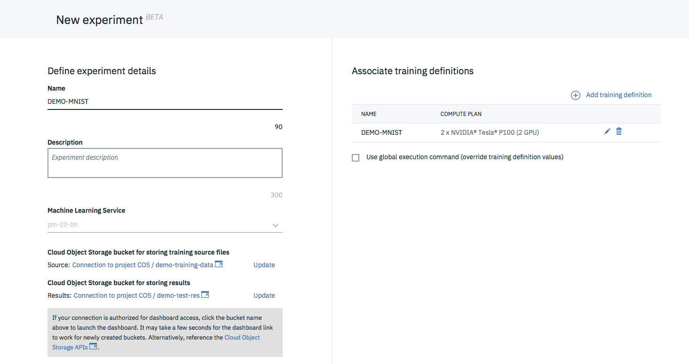

Training can take sometimes depending on your watson Machine Learning instance configuration.

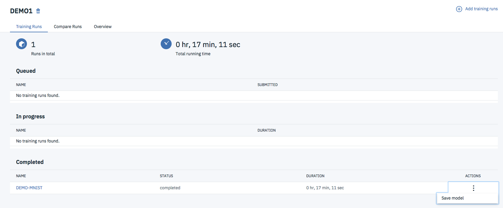

Once done, in the Training Runs tab of experiment builder, under the ACTIONS menu, select "Save model". Then give the model a name and click Save. This stores the model in the Watson Machine Learning repository.

In the Assets page of your project in Watson Studio, click the new model in the Models section.

Click the Deployments tab and then click Add Deployment.

##5-Deploy the model

From you project home click on the name of the model you just created under the model section
Clikc the Deployments tab and then click Add Deployment.
Select Virtual as deployment type and CoreML as format as the goal of thi tutorial is to deploy our model onto an Iphone application.

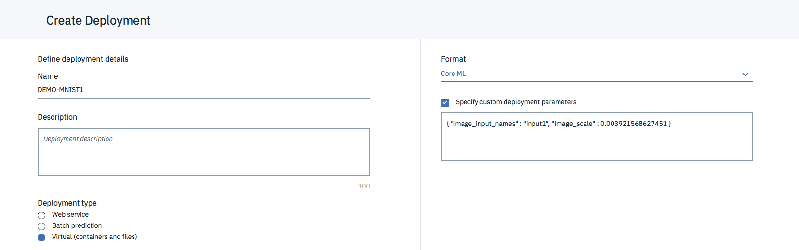

##6-Export it as a CoreML Apple iOS model

Now that the model is deployed and running in the Watson Machine Learning section we are going to export it as something consumable on the Apple devices : see [CoreML](https://developer.apple.com/documentation/coreml) for more details

To do so, click on the deploy model, go to the deployments tab and under ACTIONS select view

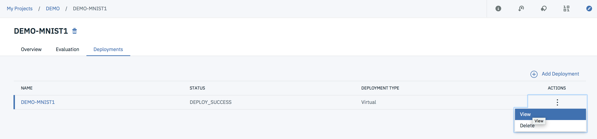

From there select the implementation tab and download the CoreML model

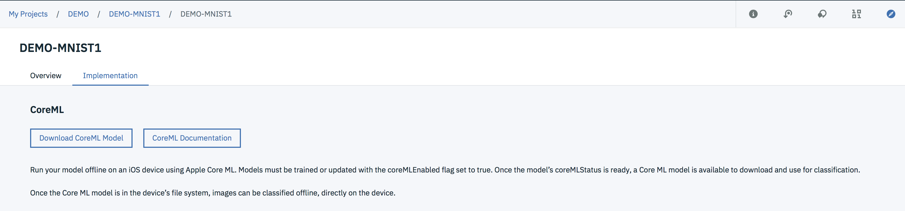

##7-Embed it into an iphone application

Now that we have a trained model compatible with Apple's CoreML framework let's play with it customzing the iphone applicaton develped by [Eridy Lukau](https://github.com/boaerosuke) accessible at this [URL](https://github.com/boaerosuke/digitrecognition_ios) 
Download the code and using Xcode make the following changes :

First you need to replace the original file called keras_mnist_cnn.mlmodel by the one generated at step 6.
The other modifcation to be made concern the application code itself regarding the ouptut of the model prediction invocation
in the file called ViewController.m at the following line (embedded wthin JLC comment tag) as followed

<code>
-(void)predictDigit{  
    //unscaled image
    //self.imageToDetect = [[CIImage alloc]initWithImage:self.drawingCanvas.image];
    
    //scaled image to 28x28
    UIImage *scaledCanvasImage = [self imageWithImage:self.drawingCanvas.image scaledToSize:CGSizeMake(28, 28)];
    self.imageToDetect = [[CIImage alloc]initWithImage:scaledCanvasImage];
    
    MLModel *ml_model = [[[keras_mnist_cnn alloc] init] model];
    VNCoreMLModel *vnc_core_ml_model = [VNCoreMLModel modelForMLModel: ml_model error:nil];
    
    VNCoreMLRequest *request = [[VNCoreMLRequest alloc] initWithModel: vnc_core_ml_model completionHandler: (VNRequestCompletionHandler) ^(VNRequest *request, NSError *error){
        NSArray *results = [request.results copy];
        
        //JLC
        VNCoreMLFeatureValueObservation *res = ((VNCoreMLFeatureValueObservation *)(results[0]));
        
        NSNumber *prediction = [NSNumber numberWithFloat:0];
        NSNumber *compare= [NSNumber numberWithFloat:0];
        int atIndex = 0;
        
        for(int i = 0; i<[res.featureValue multiArrayValue].count; i++){
            
            compare = [[res.featureValue multiArrayValue] objectAtIndexedSubscript:i];
            if([compare floatValue] > [prediction floatValue]){
                prediction = compare;
                atIndex = i;
            }
        }
        NSString *result = @"";
        double Ratio = [prediction doubleValue];
        NSNumber *Percent = @(Ratio* 100);
        self.resultLabel.text = [result stringByAppendingFormat: @"I see a : %i at %.2f percent", atIndex, [Percent doubleValue]];
        //JLC
        
        //VNClassificationObservation *res = ((VNClassificationObservation *)(results[0]));
        
        //self.resultLabel.text = [NSString stringWithFormat: @"Recognized Digit : %@", res.identifier];
    }];
</code>
Now you're ready to build and test with the iphone simulator  (7 or Higher) and/or de^loy it on your favorite apple device.

Here is how it looks like, you can see on the screenshot hereafter the app show the predicted score associated to the recognized digit. 

     

##Conclusion

Enjoy it and start to understand the neural network model provided as sample to be able to update it as significant improvements are possible.

Rendez-vous in part 2 of this tutorial for the neural network design part dedicated for Data scientists.
